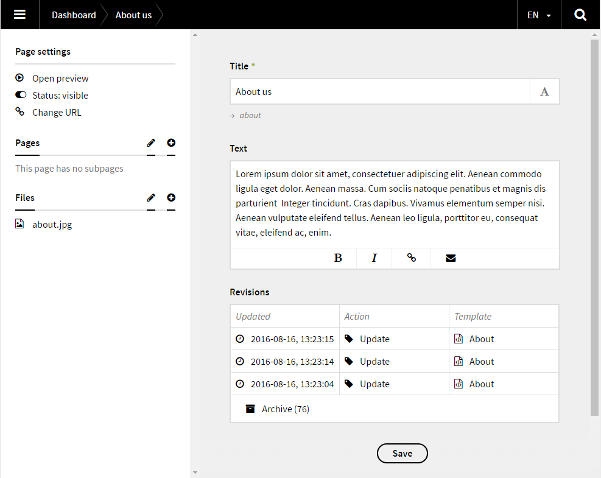
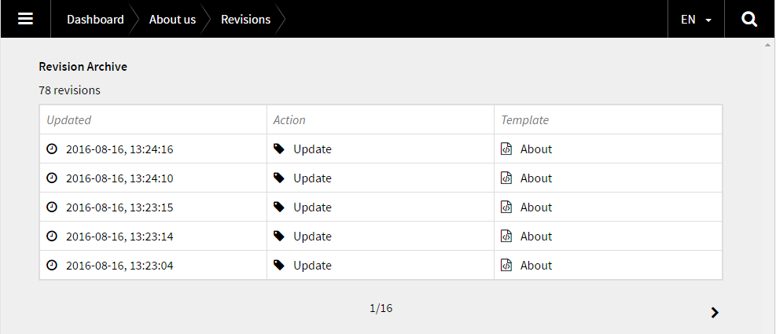
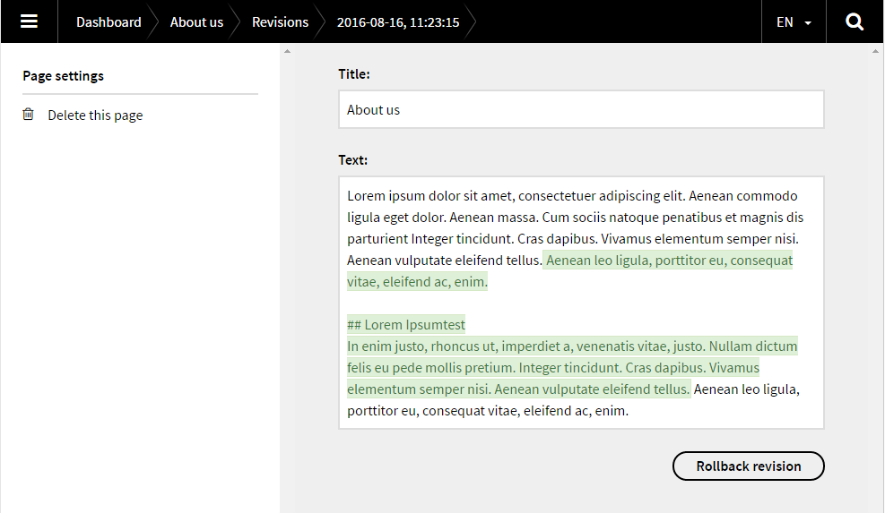

# Kirby Revisions 2

*Version 2.5 beta* - ***For version 1, see [version-1](https://github.com/jenstornell/kirby-revisions/tree/version-1) branch.***

***I do not guarantee that this is a safe way to backup and restore backups.***

## Screenshots 

**Page with revisions**



**Revisions archive**



**A revision**



## 1. Install

### Kirby CLI

Run this command:

```
kirby plugin:install jenstornell/kirby-revisions
```

### Manually

Add the folder `kirby-revisions` into `/site/plugins/`.

## 2. Setup

To show the revisions on the page you need to add a field for it.

### Blueprint

```
fields:
  revisions:
    label: Revisions
    type: revisions
```

## 3. Remove `revisions` in the queries

Every page that has revisions will have a folder called `revisions`. In your templates and snippets you need to remove it from your query.

**To do that you can use a collection filter:**

https://getkirby.com/docs/developer-guide/objects/collections
*An example might be added in a later point of time.*

## Changelog

**2.5**

- **Feature: **Added latest/current revision as a date in the field footer
- **Feature:** Added option `plugin.revisions.panel.root.url` to set if the panel is installed in another location than default
- **Feature:** Delete revision from inside revision
- **Feature:** Delete all revisions from page
- **Feature:** Delete all in revision archive
- **Feature:** Confirm warning before delete added on all revision fields
- **Feature:** Sidebar added with template, action and diff
- **Feature:** Diff numbers added to field tables
- **Feature:** Warning if template name differs to original
- **Feature:** Show fields not in blueprint separated
- **Enhancement:** Moved css from inline to `assets/css`
- **Enhancement:** Fields now share the same snippets where possible
- **Enhancement:** Renamed `Updated` to `Modified` in the page field
- **Enhancement:** Removed icons to get more space in page field
- **Enhancement:** Uses own table CSS instead of borrowing the structure field style
- **Fix:** Revisions per page in revision archive are now 25 instead of 5
- **Fix:** Hide latest/current revision to prevent rollback to itself
- **Fix:** Added `site()->errorPage()` instead of `error` to go

**2.4**

- **Bugfix:** Fixed issue with rollback in multi language

**2.3**

- **Bugfix:** Fixed an issue so it also work without multi language

**2.2**

- **Bugfix:** Corrected an error in `package.json`
- **Bugfix:** Added fix for pages that don't have revisions yet
- **Feature:** Added filesize to revisions fields

**2.1**

- **Bugfix:** Renamed revisions.php to kirby-revisions.php to match the folder name.
- Renamed `type` to `action`. 

**2.0**

- Completely rewritten
- Kirby uses pages as revisions

## Misc

**Requirements:** Kirby 2.3.2
**License:** MIT